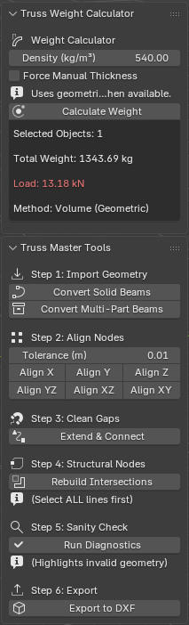

# Truss Analysis Master Suite

Truss Analysis Master Suite is a Blender add-on for converting 3D truss geometry into analysis-ready line models.

It is designed for Blender users who need to prepare truss geometry for structural analysis and detailing workflows, including tools such as Diamonds, Tekla, and similar software.

## Preview

Convert solid truss geometry into clean analysis-ready centerlines.

Align vertices before rebuilding structural joints and nodes.

Calculate weight and load directly from selected mesh objects.

### Add-on Screenshot

## What it does

- **One-click full pipeline** — Convert, align, connect, rebuild intersections, and run diagnostics in a single click
- Converts solid beam geometry into centerline truss members using **PCA axis detection** (handles diagonal/rotated beams correctly)
- **Auto-welds** coincident beam endpoints after conversion so node connectivity is correct from the start
- Handles both strict and multi-part (proximity-merge) beam conversion workflows
- Aligns selected vertices on X, Y, Z, XY, XZ, and YZ axes with cluster-based auto-grouping
- Extends and connects loose line ends to the nearest beam
- Rebuilds crossing lines into properly connected structural nodes
- **Enhanced sanity check** — detects micro-edges, floating vertices, loose ends, and duplicate edges; displays model statistics (member count, node count, total length, min/max span)
- Calculates weight and load from mesh volume or manual thickness (for dead loads)
- Exports truss lines to DXF

## Requirements

- Blender 5.0 or newer
- Python bundled with Blender (includes NumPy, used for PCA axis detection)

## Installation

1. Download or clone this repository.
2. In Blender, go to Edit > Preferences > Add-ons.
3. Click Install and select `truss.py` from this repository.
4. Enable the add-on.

## Usage

### Quick start (full auto pipeline)

1. Select your solid truss beam objects in Blender.
2. Open the 3D Viewport sidebar and go to the **Truss** tab.
3. Click **Run Full Auto Pipeline**. The add-on converts, cleans, and validates the geometry automatically.
4. Review the diagnostics shown in the panel, then export to DXF.

### Manual step-by-step

1. **Step 1 — Import**: Convert solid beams to centerlines (strict or multi-part).
2. **Step 2 — Align**: In Edit Mode, align co-planar nodes on the relevant axis using the tolerance-based cluster aligner.
3. **Step 3 — Connect**: Extend loose line ends to the nearest structural beam.
4. **Step 4 — Intersections**: Select all lines and rebuild crossing points into proper structural nodes.
5. **Step 5 — Sanity check**: Run diagnostics to validate geometry and view model statistics.
6. **Step 6 — Export**: Export to DXF for downstream analysis software.

## Included tools

| Tool | Description |
|---|---|
| Run Full Auto Pipeline | Runs all steps automatically in one click |
| Convert Solid Beams | PCA-based centerline extraction per island |
| Convert Multi-Part Beams | Proximity-merge then PCA extraction |
| Align Vertices | Cluster-based axis alignment with tolerance |
| Connect/Extend Lines | Extends free ends to the nearest beam |
| Rebuild Intersections | Splits crossing edges into connected nodes |
| Run Sanity Check | Diagnostics + model statistics |
| Calculate Weight | Weight/load from volume or manual thickness |
| Export DXF | Exports line geometry as 3D DXF |

## File structure

- `truss.py` — Blender add-on script containing the full toolset

## Notes

- The DXF exporter writes simple line entities for downstream structural analysis workflows.
- The add-on is intended for line-based truss preparation, not full finite-element solving inside Blender.
- PCA axis detection requires NumPy, which is bundled with Blender and does not need to be installed separately.
