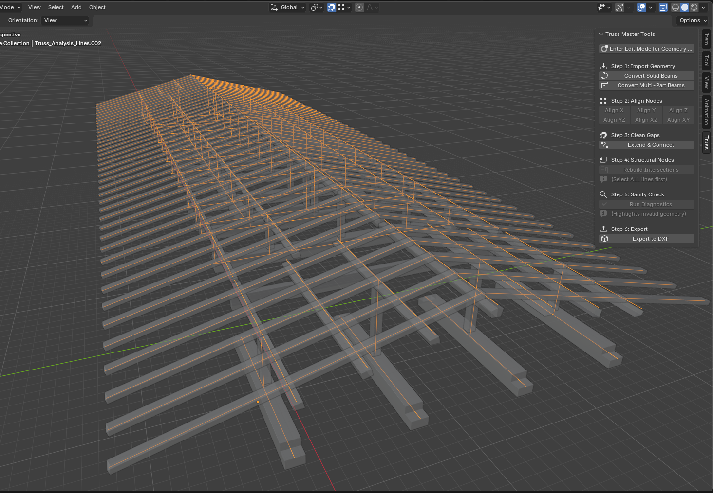
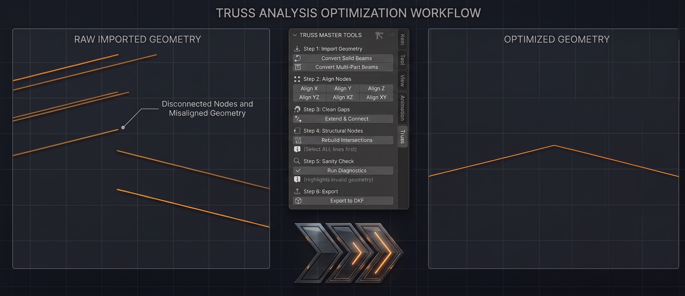

# Truss Analysis Master Suite

Truss Analysis Master Suite is a Blender add-on script for converting 3D truss geometry into analysis-ready line models.

It is designed for Blender users who need to prepare truss geometry for structural analysis and detailing workflows, including tools such as Diamonds, Tekla, and similar software.

## Preview
Convert solid truss geometry into clean analysis-ready centerlines.

Align vertices before rebuilding structural joints and nodes.

## What it does

- Converts solid beam geometry into centerline truss members
- Handles both strict and multi-part beam conversion workflows
- Aligns selected vertices on X, Y, Z, XY, XZ, and YZ axes
- Extends and connects loose line ends
- Rebuilds intersections into connected line segments
- Runs a sanity check for short edges and floating vertices
- Exports truss lines to DXF

## Requirements

- Blender 5.0 or newer
- Python bundled with Blender

## Installation

1. Download or clone this repository.
2. In Blender, go to Edit > Preferences > Add-ons.
3. Click Install and select `truss.py` from this repository.
4. Enable the add-on.

## Usage

1. Select your truss geometry in Blender.
2. Open the 3D Viewport sidebar.
3. Use the Truss tab to access the toolset.
4. Convert the solid geometry to lines, clean and align nodes, then export the result as DXF.

## Included tools

- Convert Solid Beams
- Convert Multi-Part Beams
- Align Vertices
- Connect/Extend Lines
- Rebuild Intersections
- Run Sanity Check
- Export DXF

## File structure

- `truss.py` - Blender add-on script containing the full toolset

## Notes

- The DXF exporter writes simple line entities for downstream structural analysis workflows.
- The add-on is intended for line-based truss preparation, not full finite-element solving inside Blender.